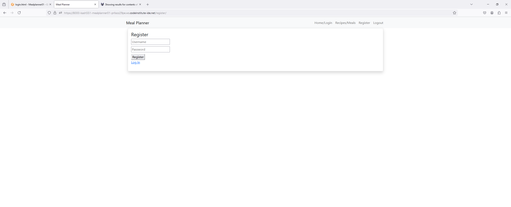

# Meal Planner:

 meal planner is a management system used to organize and schedule meals in advance. It helps individuals or families decide what they will eat for a certain period, typically a week or a month, and plan accordingly. 

The live application can be viewed here : 

https://meal-plann-92f1402c6fab.herokuapp.com/

# Purpose and Target Audience:
 **Problem Statement:** Busy schedules can make it difficult to find time to prepare meals, leading to skipped meals or unhealthy choices, also the daily pressure of deciding what to cook and ensuring you have the right ingredients can be stressful.

**Purpose:** The Meal Planner will allow the user to add/track what they would like to eat also at what time and it also gives the user the ability to add the recipe of that specific dish if they would like to return to it at a later date.

**Target Audience:** The primary target include individuals who would like to track what they are eating and who cannot find time to prepare long meals as well as those who feel pressure in not being able to decide what to eat due to not having the correct ingredients.

# Persona and User Stories:

 Rachel is a extremley busy individual who works long hours and has limited time for meal planning and preparation. She finds it difficult to keep track of what she has already ate throughout the week. Rachel is looking for a solution to her difficulties and would like to try out a meal planner. 

## User Stories:
* As a busy individual I want to be able to plan my meals ahead of time.
* As a user I want to be able to add my own meals.
* As a user I want to be able to create an account so that I can view the meals I have added.
*  As a busy individual I want to be able adjust meal plans easily for unexpected changes in my schedule.
* As a user I want to be able to edit meals on my account.
* As a user i want to be bale to delete meals.
* As a user I want to be able to logout of my account.
* As a user I want to be able to download my meal plan as a PDF.
* As a user i want to be able to view when i created a certain meal when i go to edit it and when the last time i edited it was.
* As an admin i want to be able to set the date and time for each meal specific to me and the user.

## Wireframe & Initial Design:
### Home Page/Login
 

### Register

### (Logged in) Add recipes/meals

### Gnerate the PDF page

## Agile:
This project was developed using Agile principles through a project board on GitHub. Although this is my first time implementing Agile as an individual developer, creating user stories and identifying acceptance criteria provided a roadmap for targeting the various features and functionalities of the application. This approach helped me stay on track and minimized distractions.

# Design Choices:

## Colour scheme: white and on the generate PDF page #22e010 to make it stand out to the user this is your final product.

  Nav Bar light bg

Red - Button for Gnerating the PDF so it stands out

The colours were selected with the intention of being clear for the user as I wanted the site to be about functionality and not have any distractions, simplifying it for the user.

## Typography:
 The following fonts were standard and not changed as once again I wanted the site to be minimalistic as well as being clear for all to read and utilise.

## Priority Features:

### Home Page/Login

#### Navbar & Hero Image:

The landing page provides the user with the login function as well as the create an account link directly underneath allowing the user to register if they don't already have an account. On the Home page their is also a navbar allowing the user to navigate to each page as well as the title of the site so the user knows what site they are on.

#### Registration:

Registration allows users to create an account and once an account has been created they will then be prompted to login.

####  Add Recipes:

Once logged in the user will then be faced with the add recipes page this is where the user can fill out the boxes provided with the information prompted and add the data by clicking the add data button, once this has been clicked directly below the user will be able to see the information they input in the table.

#### Update Recipe:

When the user is happy with the information they have input they can then click update data which will take them back to the previous screen and will alert them it has been successful.

#### Generate PDF:

Users are able to click the red Generate PDF button once they are happy which will then save the document to their device as a PDF document to which they can then share or print.

# Future Features:

* Implement a review system so users can share their thoughts about how they feel about the site. 
* A search engine where users can search for previous meals they have added.
* Include an about page to inform others of how The Meal Planner site works and how to use it.

Database Design:

Creating a database schema helped me by providing a clear and organized structure for the data, ensuring consistency and integrity. It allowed me to efficiently design and manage the relationships between different data entities, which facilitated smoother development and easier maintenance of the application.

## Data Models:

| Recipe   |            |   |
|----------|:-------------:|------:|
| User |  Interger |  | FK
| Day |  CharField   |    |
| Name | CharField |     |
| Description |  CharField |  |
| Created_at |  DateTimeField   |    |
| Updated_at | DateTimeField |     |

## User Flow Chart:

The flowchart was an effective tool for making crucial decisions during the app's development. It helped me prioritize decisions for both users and administrators, establish proper authentication, and determine the most important features.

# Validation
## HTML

| Page | W3C | Screenshot | Notes |
| --- | --- | --- | --- |
| Home/Login | [W3C]| ![home page validate] | Pass: |
| Update Recipe | [W3C] | | Pass: No Errors |
| Add a Recipe/Meal |  |  | Pass: No Errors |
| Register| [W3C] |  | |

 ## CSS

 I have used the recommended [CSS Jigsaw Validator](https://jigsaw.w3.org/css-validator) to validate my CSS file.
 
| File | Jigsaw URL | Screenshot | Notes |
| --- | --- | --- | --- |
| style.css | [Jigsaw] | | Pass: No Errors |

## Python

I have used the recommended [PEP8 CI Python Linter](https://pep8ci.herokuapp.com) to validate all of my Python files.

| File | CI URL | Screenshot | Notes |
| --- | --- | --- | --- |
| settings.py | [PEP8 CI] | 
 | Pass: No Errors |
| views.py | [PEP8 CI]| 
 | Pass: No Errors |
| urls.py | [PEP8 CI] | 
 | Pass: No Errors |
|  models.py | [PEP8 CI] | 
 | Pass: No Errors |

# Responsiveness:
Development tools were used to test responsiveness on varying sized devices including laptop, mobile and tablet size.

Full testing was performed on the following devices:

Desktop

Ipad

 Mobile Devices:
* Galaxy Note 20

 * Browser Compatibility:
 
 I have tested the site using the following browsers:

* Google Chrome

* Firefox

I can confirm that the site is responsive and looks as expected good on different screen sizes.

Mobile devices:

Tablet Devices:

![homepage/Login] 

![Register] 

![Add Recipe] 

![Update Recipe] 

![Generate PDF] 

# Testing:

## Lighthouse Audit:

I've tested my deployed project using the Lighthouse Audit tool to check for any major issues.

* On a desktop:

Home

![home/Login] 

update recipe 

![Update Recipe] 

Add a recipe 
!add a recipe] 

Generate PDF Page
[PDF Page] 

Register Page
[Register Page] 

On a mobile device:

Home/Login 
![audit home mobile ] 

Update Recipe
![Update Recipe Page] 

Add a Recipe 
![Add recipe/meals] 

Generate PDF Page
[PDF Page] 

Register Page
[Register Page] 

## Links

| Link | Expected Outcome | Grade |
| ------- | ---------------- | ----- |
| Logo | Navigates to the home page when clicked | Pass |
| Home/Login | Navigates to the home page when clicked | Pass |
| Update | Navigates to a update page when clicked | Pass |
| Recipes/Meals | Navigates to a form to add a recipe when clicked | Pass |
| Register | Navigates to a registration form when clicked | Pass |
| Log in | Navigates to a screen where users can log in when clicked | Pass |
| Logout | Navigates to a page confirming for the user to log out | Pass |

## Testing 

| Feature | Expected Outcome | Grade | Screenshots |
| ------- | ---------------- | ----- | --------- |
| Modal | A message will appear informing the user of a successful action | Pass | ![Logged in ]
| User logged in | Text displays the user login successful | Pass | ![modal Logged in]
| View Recipes/Meals they added | Users can see recipes/meals which they have added | Pass | ![Recipes/Meals] 
| Add a recipe/meal | Add a recipe/meal to plan what you are going to have at a later date. | Pass | ![add a recipe/meal]
| Admin has access to crud functionality of all additions | Admin can edit or delete any recipe addition | Pass | ![admin testing] 
| Edit a recipe/meal | A user can edit the details on the recipe/meal that they have addded. It will update their addition on the recipe page | Pass | ![edit recipe/meal ] 
| Delete a recipe/meal | A user who added a recipe/meal OR an admin can delete. It will then be deleted from the DB | Pass | ![delete Recipe] 
| Registration | New users can access a registration form from the "Register" link | Pass | ![testing sign up] 
| Log in | Users can log in using a form after clicking "Log in" | Pass | ![sign in testing ]
| Log out | Users get logged out after clicking "Log out" | Pass | ![testing sign out]
| Functional buttons | delete, update and add buttons will be functional throughout the site | Pass | ![edit delete buttons]

# Tools and Technologies Used:
The technologies implemented in this application included HTML, CSS, Bootstrap, Python and Django.

* Python used as the back-end programming language.
* Git used for version control. (git add, git commit, git push)
* GitHub used for secure online code storage.
* Gitpod used as a cloud-based IDE for development.
* Bootstrap used as the front-end CSS framework for modern responsiveness and pre-built components.
* CI used as the Postgres database.
* Heroku used for hosting the deployed site.
* Balsamiq Utilized for creating the wireframes
* dbdiagram used to create the database schema
* lucidchart used to create the user flow chart

* Google and Stack Overflow were used for general research, bug fixing, information gathering, and accessing various online tools.

# Languages Used:
* HTML
* CSS
* Python

# Deployment :

I followed the same steps used to deploy our Django blog to deploy this application. The instructions primarily came from the follow-along videos and text steps provided in the Code Institute LMS.

# Bugs

All the bugs that occured during the creation of this application have been resolved, however a bug that can occur is when you go to update the recipe sometimes the created at and updated at times may be slighlty off.

# Credit: 

* Most of the content was done and helped by using the LMS however i also used another website with further detail:https://www.geeksforgeeks.org/.

* Stack Overflow was used to solve any smaller bugs and further clarification on errors I was receiving in the terminal.

* Wireframes were made using balsamiq.
* Flow chart was made using lucidchart.
* Database schema was made using dbdiagram.io.

